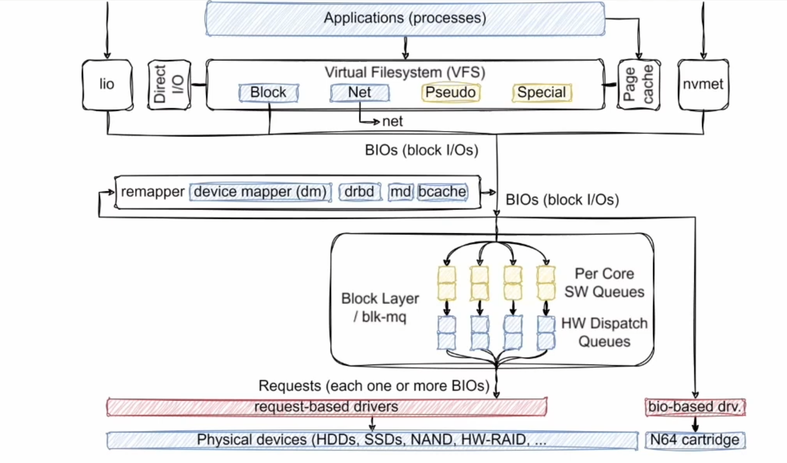
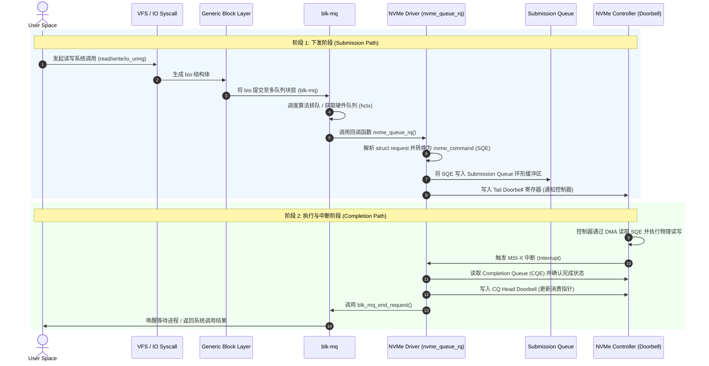

### Block layer


### sysfs分析
```
/sys/block/nvme0n1/ 来自于/block/blk-sysfs.c和/drivers/nvme/host/core.c等等
为/sys/devices/pci0000:00/0000:00:15.0/0000:03:00.0/nvme/nvme0/nvme0n1的软链接

$ ls /sys/block/nvme0n1
alignment_offset  discard_alignment  hidden          nguid                     power/       size       uuid
bdi@              diskseq            holders/        nsid                      queue/       slaves/    wwid
capability        events             inflight        numa_nodes                queue_depth  stat
csi               events_async       integrity/      nuse                      range        subsystem@
dev               events_poll_msecs  metadata_bytes  partscan                  removable    trace/
device@           ext_range          mq/             passthru_err_log_enabled  ro           uevent

```


```
/sys/block/nvme0n1/queue/scheduler
参数:
nomerges(I/O 请求合并): 内核块层是否尝试将相邻的小 I/O 请求合并成一个大 I/O 请求
- 0(允许全部合并)
- 1(仅允许部分合并)
- 2(完全禁用合并)

rq_affinity(I/O 请求亲和性):当 I/O 请求完成时，由哪个 CPU 核心来处理中断和后续回调
- 0(关闭亲和性，中断可以在任意 CPU 上处理) 
- 1(默认组亲和。块层会尽量将请求完成调度回最初提交该请求的 CPU 组，利用 CPU 缓存效应降低开销)
- 2(强制严格亲和。强制将 I/O 完成处理绑定到提交请求的同一个 CPU 上)

nr_requests(队列深度上限):操作系统内核在块层为该设备单方向（读或写）最多可以缓存的请求数量上限
max_sectors_kb(单次IO请求最大KB数):
max_hw_sectors_kb(nvme控制器单次IO支持的最大KB数):


中断亲和性()
$ systemctl status irqbalance
关闭系统默认的 irqbalance 服务Linux 默认开启的 irqbalance 服务会自动动态调整中断
$ sudo systemctl stop irqbalance


$ ls /sys/bus/pci/devices/0000:00:15.0/0000:03:00.0/msi_irqs/ （先去这里看这个盘占用了哪些中断号）或者是
$ cat /proc/interrupts | grep nvme0
示例
            CPU0       CPU1       CPU2       CPU3       
  57:          0          0          0        117 PCI-MSIX-0000:03:00.0    0-edge      nvme0q0
  58:         45          0          0          0 PCI-MSIX-0000:03:00.0    1-edge      nvme0q1
  59:          0        100          0          0 PCI-MSIX-0000:03:00.0    2-edge      nvme0q2
  60:          0          0         90          0 PCI-MSIX-0000:03:00.0    3-edge      nvme0q3
  61:          0          0          0         38 PCI-MSIX-0000:03:00.0    4-edge      nvme0q4
  ...
  ...
  70:          0          0          0          0 PCI-MSIX-0000:03:00.0   13-edge      nvme0q13
  71:          0          0          0          0 PCI-MSIX-0000:03:00.0   14-edge      nvme0q14
  72:          0          0          0          0 PCI-MSIX-0000:03:00.0   15-edge      nvme0q15


最左侧的 57, 58, 59 就是这个 NVMe 盘的各个队列的中断号。
CPU现代内核支持 smp_affinity_list（直接写 CPU 编号，比传统的十六进制掩码更简单直观）
smp_affinity_list 和 smp_affinity

$ cat /proc/irq/60/smp_affinity_list
2,112-119

$sudo echo 0 > /proc/irq/60/smp_affinity_list

```


```
$ lscpu
NUMA:                        
  NUMA node(s):              1
  NUMA node0 CPU(s):         0-3

$ numactl -H
available: 1 nodes (0)
node 0 cpus: 0 1 2 3
node 0 size: 15945 MB
node 0 free: 11851 MB
node distances:
node   0 
  0:  10 

  
$ cat /sys/block/nvme0n1/device/numa_node
如果返回 0：说明 NVMe 硬盘在物理上直接连在 NUMA 0 的 PCIe 通道上
如果返回 1：说明它直接连在 NUMA 1 上
如果返回 -1：说明系统没开启 NUMA 或者硬件没上报，此时通常默认当做 NUMA 0 处理

```


### I/O Schedulers

```
# 查看硬盘使用的队列调度器
# 中括号[]标记的时当前生效的
$ cat /sys/block/nvme0n1/queue/scheduler

none:(无调度器 / 绕过软件调度)
- 直接将块层的 I/O 请求透传给底层的驱动和设备硬件


bfq:(Budget Fair Queuing，预算公平排队)
- 为每个进程分配 I/O 预算（按扇区数而非时间片），旨在保证多任务并发时 I/O 带宽的公平分配和良好的交互响应性


mq-deadline: (多队列 Deadline 调度器)
- 将 I/O 请求分为"读"和"写"两个队列，并为每个请求设置一个严格的过期时间（默认读 500ms，写 5s）优先处理读请求，防止请求饥饿
    - read_expire：读请求的超时时间（毫秒，默认 500）
    - write_expire：写请求的超时时间（毫秒，默认 5000）


kyber:
- 采用 PID（比例-积分-微分）控制器原理，通过监控读/写的延迟，动态调整软件队列的深度上限，从而在保障低延迟的同时限制吞吐量饱和带来的排队
```


/sys/block/nvme*/mq/<编号> → hctx（硬件通道）
/sys/block/nvme*/mq/<编号>/cpu_list → 查看哪些 ctx（CPU 核心）映射到了这个硬件通道。

### blk-mq







### 结构体分析

```
# 结构体 bio

struct bio {
	struct bio		*bi_next;	  // 链表指针，用于将多个 bio 链接在一起
	struct block_device	*bi_bdev;   // 目标块设备
	blk_opf_t		bi_opf;		  // 操作码和控制标志
	unsigned short		bi_flags;	// Bio 状态标志位
	unsigned short		bi_ioprio;  // I/O 优先级
	blk_status_t		bi_status;    // blk IO完成状态码
	atomic_t		__bi_remaining;   // 原子计数器：子 IO 完成的汇聚计数(到0可以触发回调)
	struct bvec_iter	bi_iter;    // 核心迭代器：扇区寻址与内存切片
	bio_end_io_t		*bi_end_io;    // 异步结束回调函数指针
	void			*bi_private;     // 私有数据上下文
    unsigned short		bi_vcnt;	// bio_vec 数组中的有效元素总数
    unsigned short		bi_max_vecs;	 // bio 能容纳的最大 bio_vec 数量
    atomic_t    __bi_cnt;   // 原子计数器：bio 内存生命周期引用计数(到0可以触发内存回收)
	struct bio_vec		*bi_io_vec;	  // 数据载荷指针：指向物理内存页数组 SGL/PRP
    /*...*/
};

# 结构体 bio_vec

struct bio_vec {
	struct page	*bv_page;     // 数据所在的物理内存页的指针
	unsigned int	bv_len;    // 数据的字节数长度
	unsigned int	bv_offset;  // 数据在物理页内的起始偏移量
};


# 结构体 request

struct request {
	struct request_queue *q;    // 请求所属的队列
	struct blk_mq_ctx *mq_ctx;    // 软件准备队列上下文
	struct blk_mq_hw_ctx *mq_hctx;   //硬件提交队列上下文

	blk_opf_t cmd_flags;		// 操作类型与标志
	req_flags_t rq_flags;     // rq本身状态

	int tag;    // 硬件队列 Tag 对应 NVMe Command ID
	int internal_tag; // 调度器内部 Tag

	unsigned int timeout;  // 命令超时时间，看门狗检测

	/* the following two fields are internal, NEVER access directly */
	unsigned int __data_len;	// 包含的总数据字节数
	sector_t __sector;		// 传输的起始逻辑扇区号

	struct bio *bio;     // 挂载的第一个bio
	struct bio *biotail; // 挂载的最后一个bio
    
	/* completion callback.*/
	rq_end_io_fn *end_io;   // 结束回调函数指针
	void *end_io_data;  // 回调函数的私有上下文指针
    /*...*/
};


```


### 系统调用


```
系统调用

write
-> SYSCALL_DEFINE3(write, unsigned int, fd, const char __user *, buf,
		size_t, count){ ... }
-> SYSCALL_DEFINE3(read, unsigned int, fd, char __user *, buf, size_t, count)
{
	return ksys_read(fd, buf, count);
}
-> ksys_write / ksys_read
-> vfs_write / vfs_read
-> file->f_op->write_iter / file->f_op->read_iter

---

libaio
-> SYSCALL_DEFINE3(io_submit, aio_context_t, ctx_id, long, nr,
		struct iocb __user * __user *, iocbpp){ ... }
-> io_submit_one()
-> aio_write() / aio_read()
-> file->f_op->write_iter / file->f_op->read_iter

---

io_uring
SYSCALL_DEFINE6(io_uring_enter, unsigned int, fd, u32, to_submit,
		u32, min_complete, u32, flags, const void __user *, argp,
		size_t, argsz){ ... }
-> io_submit_sqes()
-> io_submit_sqe()
-> io_queue_sqe()
-> io_issue_sqe()
-> __io_issue_sqe()   通过 ret = def->issue(req, issue_flags)   def 是指向 const struct io_issue_def io_issue_defs[] 指针
-> io_read() / io_write()               /  io_uring_cmd() 透传
-> __io_read() / file->f_op->write_iter   /   file->f_op->uring_cmd  -> nvme_dev_uring_cmd()
-> io_iter_do_read
-> file->f_op->read_iter


SYSCALL_DEFINE2(io_uring_setup, u32, entries,
		struct io_uring_params __user *, params) { ...}
-> io_uring_setup()  

IORING_SETUP_SQPOLL  # 线程轮询 SQ队列
fio 
sqthread_poll=1
sqthread_poll_cpu=2  # 强行内核 SQ 线程死绑定在 2 号 CPU 核心

IORING_SETUP_IOPOLL # 轮询硬件/驱动的完成状态
hipri=1


SYSCALL_DEFINE4(io_uring_register, unsigned int, fd, unsigned int, opcode,
		void __user *, arg, unsigned int, nr_args) { ... }


---

ioctl

SYSCALL_DEFINE3(ioctl, unsigned int, fd, unsigned int, cmd, unsigned long, arg)
{ ... }
-> vfs_ioctl() 
filp->f_op->unlocked_ioctl

-> nvme_dev_ioctl()

```

### 内核模块

裸盘写入 file->f_op->write_iter 直接进入到blkdev_write_iter

如果有文件系统 file->f_op->write_iter 就进入到 不同文件系统的 ext4_file_write_iter/
xfs_file_write_iter / f2fs_file_write_iter 等等


```

ext4_file_write_iter()
-> ext4_dio_write_iter() /  ext4_buffered_write_iter()  这里分析前者direct io
-> iomap_dio_rw()  
-> __iomap_dio_rw()
-> iomap_dio_iter()
-> iomap_dio_bio_iter()
-> iomap_dio_submit_bio()
-> submit_bio()

```


```
const struct file_operations def_blk_fops = {
	.open		= blkdev_open,
	.release	= blkdev_release,
	.llseek		= blkdev_llseek,
	.read_iter	= blkdev_read_iter,
	.write_iter	= blkdev_write_iter,
	.iopoll		= iocb_bio_iopoll,
	.mmap_prepare	= blkdev_mmap_prepare,
	.fsync		= blkdev_fsync,
	.unlocked_ioctl	= blkdev_ioctl,
#ifdef CONFIG_COMPAT
	.compat_ioctl	= compat_blkdev_ioctl,
#endif
	.splice_read	= filemap_splice_read,
	.splice_write	= iter_file_splice_write,
	.fallocate	= blkdev_fallocate,
	.uring_cmd	= blkdev_uring_cmd,
	.fop_flags	= FOP_BUFFER_RASYNC,
};


blkdev_write_iter()           //   blkdev_read_iter() 是直接到 blkdev_direct_IO()
  ├── blkdev_direct_write()  // 这里还有一种 blkdev_buffered_write()先不研究了
  |  
  ├── blkdev_direct_IO()
  │
  │  ┌── __blkdev_direct_IO_simple()  // 小 IO (nr_pages <= BIO_MAX_VECS)   同步IO
  │  │   └── submit_bio_wait()     
  │  │       └── submit_bio()    
  │  │
  ├──┼── __blkdev_direct_IO()          // 大 IO 或 带端到端元数据IOCB_HAS_METADATA
  │  │   └── submit_bio()              // 元数据 LBAF 1 : Metadata Size: 8  bytes - Data Size: 4096 bytes
  │  │
  │  └── __blkdev_direct_IO_async()   // 小 IO  异步IO
  │      └── submit_bio()
  │
  ├── submit_bio()
  |
  ├── submit_bio_noacct()
  |
  ├── submit_bio_noacct_nocheck()
  |
  ├── __submit_bio_noacct()  / __submit_bio_noacct_mq()
  |
  ├── __submit_bio()
  |
  └── blk_mq_submit_bio()


blk_mq_submit_bio()
  ├── blk_mq_peek_cached_request()                // 尝试获取缓存的 request
  |
  ├── __bio_split_to_limits()                     // bio检查是否切分
  ├── bio_integrity_prep()                        // 数据完整性校验
  ├── blk_mq_attempt_bio_merge()                  // bio尝试合并到现有 request
  |
  ├── if (rq)
  │   └── blk_mq_use_cached_rq()                  // 复用缓存的 request
  │   else
  │   └── blk_mq_get_new_requests()               // 申请新 request 流程
  │
  ├── blk_mq_bio_to_request()                      // bio 数据填充至新 request
  │
  ├── if (plug)
  │   └── blk_add_rq_to_plug()                     // 暂存至 plug 蓄水池以备批量下发
  │       └── blk_mq_flush_plug_list()             // [条件触发] 在蓄水池满时或者是其他情况泄流
  │           │  ┌── blk_mq_dispatch_multiple_queue_requests() // 无调度器且非被迫睡眠触发, 多设备测试 rq->q 不同设备不一样
  │           └──┼── blk_mq_dispatch_queue_requests()          // 无调度器且非被迫睡眠触发, 单设备测试 rq->q
  │              └── blk_mq_dispatch_list()                    // 支持带有调度器或休眠触发
  │         
  │ 
  ├── if ((rq->rq_flags & RQF_USE_SCHED) || (hctx->dispatch_busy && (q->nr_hw_queues == 1 || !is_sync)))
  │   ├── blk_mq_insert_request()                    // 插入到 IO 调度器或软件队列
  │   └── blk_mq_run_hw_queue()                        // 异步触发硬件队列调度
  │
  └── else
      ├── blk_mq_run_dispatch_ops()                     // 开启并执行驱动分发操作
      └── blk_mq_try_issue_directly()                  // 快速路径：绕过调度器直接下发给驱动
          └── __blk_mq_issue_directly()
                q->mq_ops->queue_rq(hctx, &bd)


```