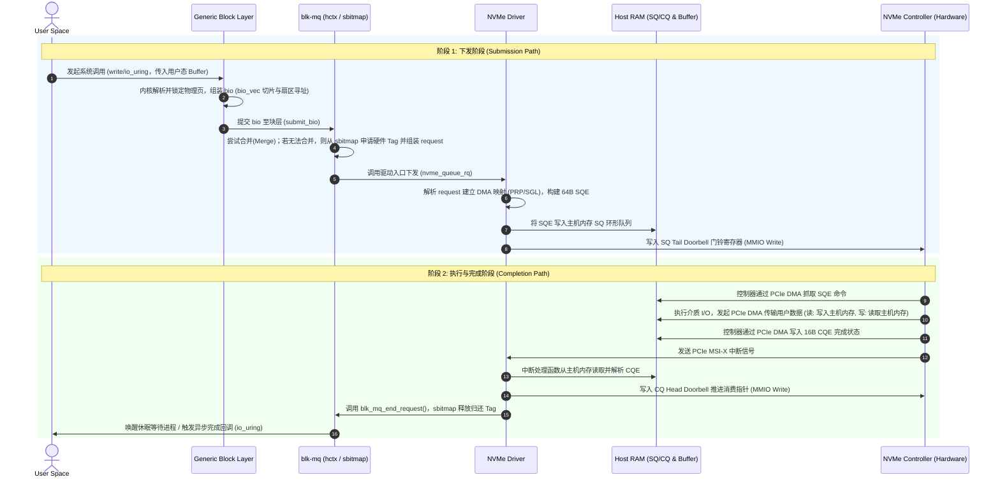

# Linux Block 和 blk-mq

## 1. blk-mq 多队列机制

### 1.1 双层队列架构

传统单队列的全局自旋锁`queue_lock`成为吞吐瓶颈。为此 blk-mq 将 I/O 调度拆分为两级解耦模型：


多队列总体架构核心层级抽象如下：

```
+-------------------------------------------------------------+
|                 软件暂存队列 (Software Queues)              |
|   [CPU 0: ctx 0]   [CPU 1: ctx 1]  ...  [CPU N-1: ctx N-1]  |
|   - Per-CPU                                               |
+-------------------------------------------------------------+
                              │
                              ▼ (映射: map_queues)
+-------------------------------------------------------------+
|                 硬件分发队列 (Hardware Queues)              |
|   [hctx 0]           [hctx 1]         ...   [hctx M-1]      |
|   - 内核层抽象，管理 Tag 分配与批量派发                     |
+-------------------------------------------------------------+
                              │
                              ▼ (驱动 1:1 绑定)
+-------------------------------------------------------------+
|                 底层 NVMe 控制器物理队列                    |
|   [NVMe SQ/CQ 1]     [NVMe SQ/CQ 2]   ...   [NVMe SQ/CQ M]  |
|   - 物理 DMA 环形缓冲区 (敲门铃下发/收尾)                    |
|   - SQ/CQ 0 专用于管理指令 (Admin Queue)                   |
+-------------------------------------------------------------+
```

- **Per-CPU 软件暂存队列 (`struct blk_mq_ctx`/ `ctx`)**：每个 CPU 核心独占一个软件队列上下文，避免多核并发提交 I/O 时的共享锁竞争
- **硬件分发队列 (`struct blk_mq_hw_ctx` / `hctx`)**：通常一对一映射底层 NVMe 硬件 I/O Queue
  - 通过 sysfs 查看当前的映射关系：
    ```bash

    # 查看硬盘有哪些硬件通道 hctx  15 条
    $ ls /sys/block/nvme0n1/mq
    0  1  10  11  12  13  14  2  3  4  5  6  7  8  9

    # 查看硬件通道 0 绑定了哪些 CPU 核心 ctx
    $ cat /sys/block/nvme0n1/mq/0/cpu_list
    0
    ```

### 1.2 I/O 下发与完成生命周期

一个 I/O 请求的完整生命周期可清晰划分为**下发** 与 **完成**阶段：



## 2. 块层数据结构

**数据结构层次关系**
```
[struct request] (驱动派发单元，持有硬件 Tag/CID)
  ├── rq->bio ───────> [struct bio (1)] ──(bi_next)──> [struct bio (2)] (I/O 顺序合并)
  └── rq->biotail ──────────────────────────────────────────┘
                              │ (bi_io_vec 数组)
                              ├──> bio_vec[0] ──> [ struct page A (物理页) + 偏移 + 长度 ]
                              ├──> bio_vec[1] ──> [ struct page B (物理页) + 偏移 + 长度 ]
                              └──> ...
```

### 2.1 `struct bio` I/O 传输载荷单元

```c
struct bio {
	struct bio		*bi_next;	  // 链表指针，用于将多个 bio 链接在一起
	struct block_device	*bi_bdev;   // 目标块设备
	blk_opf_t		bi_opf;		  // 操作码和控制标志
	unsigned short		bi_flags;	// Bio 状态标志位
	unsigned short		bi_ioprio;  // I/O 优先级
	blk_status_t		bi_status;    // blk IO完成状态码
	atomic_t		__bi_remaining;   // 原子计数器：子 IO 完成的汇聚计数(到0可以触发回调)
	struct bvec_iter	bi_iter;    // 核心迭代器：扇区寻址与内存切片
	bio_end_io_t		*bi_end_io;    // 异步结束回调函数指针
	void			*bi_private;     // 私有数据上下文
    unsigned short		bi_vcnt;	// bio_vec 数组中的有效元素总数
    unsigned short		bi_max_vecs;	 // bio 能容纳的最大 bio_vec 数量
    atomic_t    __bi_cnt;   // 原子计数器：bio 内存生命周期引用计数(到0可以触发内存回收)
	struct bio_vec		*bi_io_vec;	  // 数据载荷指针：指向用户数据所在的物理页切片数组
    [...]
};
```


### 2.2 `struct bio_vec` 物理页切片

```c
struct bio_vec {
	struct page	*bv_page;     // 数据所在的物理内存页的指针
	unsigned int	bv_len;    // 数据的字节数长度
	unsigned int	bv_offset;  // 数据在物理页内的起始偏移量
};
```


### 2.3 `struct request` I/O 调度与硬件派发执行单元

```c
struct request {
	struct request_queue *q;    // 请求所属的队列
	struct blk_mq_ctx *mq_ctx;    // 软件准备队列上下文
	struct blk_mq_hw_ctx *mq_hctx;   //硬件提交队列上下文

	blk_opf_t cmd_flags;		// 操作类型与标志
	req_flags_t rq_flags;     // rq本身状态

	int tag;    // 硬件队列 Tag 对应 NVMe Command ID
	int internal_tag; // 调度器内部 Tag

	unsigned int timeout;  // 命令超时时间，看门狗检测

	/* the following two fields are internal, NEVER access directly */
	unsigned int __data_len;	// 包含的总数据字节数
	sector_t __sector;		// 传输的起始逻辑扇区号

	struct bio *bio;     // 挂载的第一个bio
	struct bio *biotail; // 挂载的最后一个bio
  
  unsigned short nr_phys_segments;   // 物理离散段数
	unsigned short nr_integrity_segments;   // 数据完整性校验段数

	/* completion callback.*/
	rq_end_io_fn *end_io;   // 结束回调函数指针
	void *end_io_data;  // 回调函数的私有上下文指针
    [...]
};
```


## 3. 系统调用与路径

**Linux 用户态 I/O 下发接口**
- **同步 I/O (`read` / `write`)**
- **异步 I/O (`libaio`)**
- **高性能 I/O (`io_uring`)**
- **设备管理与带外控制 (`ioctl`)**

### 3.1 同步I/O (`write` / `read`)

```c
// write / read
-> SYSCALL_DEFINE3(write, unsigned int, fd, const char __user *, buf,
		size_t, count){ ... }
-> SYSCALL_DEFINE3(read, unsigned int, fd, char __user *, buf, size_t, count)
{
	return ksys_read(fd, buf, count);
}
-> ksys_write() / ksys_read()
-> vfs_write() / vfs_read()
-> file->f_op->write_iter / file->f_op->read_iter
```


### 3.2 异步I/O (`libaio`)

```c
// libaio
-> SYSCALL_DEFINE3(io_submit, aio_context_t, ctx_id, long, nr,
		struct iocb __user * __user *, iocbpp){ ... }
-> io_submit_one()
-> aio_write() / aio_read()
-> file->f_op->write_iter / file->f_op->read_iter
```

### 3.3 高性能I/O (`io_uring`)

```c
// io_uring
SYSCALL_DEFINE6(io_uring_enter, unsigned int, fd, u32, to_submit,
		u32, min_complete, u32, flags, const void __user *, argp,
		size_t, argsz){ ... }
-> io_submit_sqes()
-> io_submit_sqe()
-> io_queue_sqe()
-> io_issue_sqe()
-> __io_issue_sqe()   通过 ret = def->issue(req, issue_flags)   def 是指向 const struct io_issue_def io_issue_defs[] 指针

// 常规路径
-> __io_issue_sqe()
-> io_read() / io_write()               
-> __io_read() / file->f_op->write_iter      
-> io_iter_do_read                
-> file->f_op->read_iter

// Passthrough路径
-> __io_issue_sqe()
-> io_uring_cmd() 透传
-> file->f_op->uring_cmd  
-> nvme_dev_uring_cmd() / nvme_ns_chr_uring_cmd() / blkdev_uring_cmd() 


SYSCALL_DEFINE2(io_uring_setup, u32, entries,
		struct io_uring_params __user *, params) { ...}
-> io_uring_setup()  

/*

IORING_SETUP_SQPOLL  # 线程轮询 SQ队列
sqthread_poll=1

IORING_SETUP_IOPOLL # 轮询硬件/驱动的完成状态
hipri=1

*/

SYSCALL_DEFINE4(io_uring_register, unsigned int, fd, unsigned int, opcode,
		void __user *, arg, unsigned int, nr_args) { ... }
```

### 3.4 设备管理与带外控制 (`ioctl`)

```c
// ioctl
SYSCALL_DEFINE3(ioctl, unsigned int, fd, unsigned int, cmd, unsigned long, arg)
{ ... }
-> vfs_ioctl() 
filp->f_op->unlocked_ioctl

-> nvme_dev_ioctl() / nvme_ns_chr_ioctl() / blkdev_ioctl()
```


## 4. 内核块设备下发路径

### 4.1 块设备入口

- 裸盘写入 `file->f_op->write_iter` 直接进入到`blkdev_write_iter`

- 如果有文件系统 `file->f_op->write_iter` 就进入到 不同文件系统的 `ext4_file_write_iter`/
`xfs_file_write_iter` / `f2fs_file_write_iter` 等等


**ext4文件系统路径**
```c
ext4_file_write_iter()
-> ext4_dio_write_iter() /  ext4_buffered_write_iter()  这里分析前者direct io
-> iomap_dio_rw()  
-> __iomap_dio_rw()
-> iomap_dio_iter()
-> iomap_dio_bio_iter()
-> iomap_dio_submit_bio()
-> submit_bio()
```


**通用块设备文件操作集def_blk_fops**
```c
const struct file_operations def_blk_fops = {
	.open		= blkdev_open,
	.release	= blkdev_release,
	.llseek		= blkdev_llseek,
	.read_iter	= blkdev_read_iter,
	.write_iter	= blkdev_write_iter,
	.iopoll		= iocb_bio_iopoll,
	.mmap_prepare	= blkdev_mmap_prepare,
	.fsync		= blkdev_fsync,
	.unlocked_ioctl	= blkdev_ioctl,
#ifdef CONFIG_COMPAT
	.compat_ioctl	= compat_blkdev_ioctl,
#endif
	.splice_read	= filemap_splice_read,
	.splice_write	= iter_file_splice_write,
	.fallocate	= blkdev_fallocate,
	.uring_cmd	= blkdev_uring_cmd,
	.fop_flags	= FOP_BUFFER_RASYNC,
};
```


### 4.2 块设备直通汇聚

```c
blkdev_write_iter()           //   blkdev_read_iter() 在 Direct IO 模式下同样汇聚至 blkdev_direct_IO()
  └── blkdev_direct_write()  // 这里还有一种 blkdev_buffered_write()  
      └── blkdev_direct_IO()
          │
          ├── __blkdev_direct_IO_simple()  // 小 IO (nr_pages <= BIO_MAX_VECS)   同步IO
          │   └── submit_bio_wait()     
          │       └── submit_bio()    
          │
          ├── __blkdev_direct_IO()          // 大 IO 或 带端到端元数据IOCB_HAS_METADATA
          │   └── submit_bio()              // 元数据 LBAF 1 : Metadata Size: 8  bytes - Data Size: 4096 bytes
          │
          └── __blkdev_direct_IO_async()   // 小 IO  异步IO
              └── submit_bio()
                  └── submit_bio_noacct()
                      └── submit_bio_noacct_nocheck()
                          └── __submit_bio_noacct()  / __submit_bio_noacct_mq()
                              └── __submit_bio()
                                  └── blk_mq_submit_bio()
```


### 4.3 blk-mq 调度与派发

```c
blk_mq_submit_bio()
  ├── blk_mq_peek_cached_request()                // 尝试获取缓存的 request
  │
  ├── __bio_split_to_limits()                     // bio检查是否切分
  ├── bio_integrity_prep()                        // 数据完整性校验
  ├── blk_mq_attempt_bio_merge()                  // bio尝试合并到现有 request
  │
  ├── if (rq)
  │   └── blk_mq_use_cached_rq()                  // 复用缓存的 request
  │   else
  │   └── blk_mq_get_new_requests()               // 申请新 request 流程
  │
  ├── blk_mq_bio_to_request()                      // bio 数据填充至新 request
  │
  ├── if (plug)
  │   └── blk_add_rq_to_plug()                     // 暂存至 plug 蓄水池以备批量下发
  │       └── blk_mq_flush_plug_list()             // [条件触发] 在蓄水池满时或者是其他情况泄流
  │           │  ┌── blk_mq_dispatch_multiple_queue_requests() // 无调度器且非被迫睡眠触发, 多设备测试 rq->q 不同设备不一样
  │           └──┼── blk_mq_dispatch_queue_requests()          // 无调度器且非被迫睡眠触发, 单设备测试 rq->q
  │              └── blk_mq_dispatch_list()                    // 支持带有调度器或休眠触发
  │         
  │ 
  ├── if ((rq->rq_flags & RQF_USE_SCHED) || (hctx->dispatch_busy && (q->nr_hw_queues == 1 || !is_sync)))
  │   ├── blk_mq_insert_request()                    // 插入到 IO 调度器或软件队列
  │   └── blk_mq_run_hw_queue()                        // 异步触发硬件队列调度
  │
  └── else 
      blk_mq_run_dispatch_ops(q, blk_mq_try_issue_directly(hctx, rq));
      ├── blk_mq_run_dispatch_ops()                     // 开启并执行驱动分发操作
      └── blk_mq_try_issue_directly()                  // 快速路径：绕过调度器直接下发给驱动
          └── __blk_mq_issue_directly()
                q->mq_ops->queue_rq(hctx, &bd)
```


## 5. sysfs分析

### 5.1 块设备sys总览

```bash
# /sys/block/nvme0n1/ 来自于/block/blk-sysfs.c和/drivers/nvme/host/core.c等等
# 其为/sys/devices/pci0000:00/0000:00:15.0/0000:03:00.0/nvme/nvme0/nvme0n1的软链接
$ ls /sys/block/nvme0n1
alignment_offset  discard_alignment  hidden          nguid                     power/       size       uuid
bdi@              diskseq            holders/        nsid                      queue/       slaves/    wwid
capability        events             inflight        numa_nodes                queue_depth  stat
csi               events_async       integrity/      nuse                      range        subsystem@
dev               events_poll_msecs  metadata_bytes  partscan                  removable    trace/
device@           ext_range          mq/             passthru_err_log_enabled  ro           uevent
```

### 5.2 I/O Schedulers

```bash
# 查看硬盘使用的队列调度器
# 中括号[]标记的时当前生效的
$ cat /sys/block/nvme0n1/queue/scheduler

# none:(绕过软件调度)
# 直接将块层的 I/O 请求透传给底层的驱动和设备硬件

# bfq:(Budget Fair Queuing，预算公平排队)
# 为每个进程分配 I/O 预算（按扇区数而非时间片），旨在保证多任务并发时 I/O 带宽的公平分配和良好的交互响应性

# mq-deadline: (多队列 Deadline 调度器)
# 将 I/O 请求分为"读"和"写"两个队列，并为每个请求设置一个严格的过期时间（默认读 500ms，写 5s）优先处理读请求，防止请求饥饿
#    read_expire：读请求的超时时间（毫秒，默认 500）
#    write_expire：写请求的超时时间（毫秒，默认 5000）

# kyber:
# 采用 PID（比例-积分-微分）控制器原理，通过监控读/写的延迟，动态调整软件队列的深度上限，从而在保障低延迟的同时限制吞吐量饱和带来的排队
```


### 5.3 部分参数解析

**queue**
```
/sys/block/nvme0n1/queue/

nomerges(I/O 请求合并): 内核块层是否尝试将相邻的小 I/O 请求合并成一个大 I/O 请求
- 0(允许全部合并)
- 1(仅允许部分合并)
- 2(完全禁用合并)

rq_affinity(I/O 请求亲和性):当 I/O 请求完成时，由哪个 CPU 核心来处理中断和后续回调
- 0(关闭亲和性，中断可以在任意 CPU 上处理) 
- 1(默认组亲和。块层会尽量将请求完成调度回最初提交该请求的 CPU 组，利用 CPU 缓存效应降低开销)
- 2(强制严格亲和。强制将 I/O 完成处理绑定到提交请求的同一个 CPU 上)

nr_requests(队列深度上限):操作系统内核在块层为该设备单方向（读或写）最多可以缓存的请求数量上限

max_sectors_kb(单次IO请求最大KB数):

max_hw_sectors_kb(nvme控制器单次IO支持的最大KB数):
```


### 5.4 MSI-X中断亲和性
```bash
$ systemctl status irqbalance
# 关闭系统默认的 irqbalance 服务Linux 默认开启的 irqbalance 服务会自动动态调整中断
$ sudo systemctl stop irqbalance

# 查看盘占用的中断号
$ ls /sys/bus/pci/devices/0000:00:15.0/0000:03:00.0/msi_irqs/  
$ cat /proc/interrupts | grep nvme0
            CPU0       CPU1       CPU2       CPU3       
  57:          0          0          0        117 PCI-MSIX-0000:03:00.0    0-edge      nvme0q0
  74:         28          0          0          0 PCI-MSIX-0000:03:00.0    1-edge      nvme0q1
  75:          0         14          0          0 PCI-MSIX-0000:03:00.0    2-edge      nvme0q2
  76:          0          0         85          0 PCI-MSIX-0000:03:00.0    3-edge      nvme0q3
  77:          0          0          0         37 PCI-MSIX-0000:03:00.0    4-edge      nvme0q4

  ...
  ...
  70:          0          0          0          0 PCI-MSIX-0000:03:00.0   13-edge      nvme0q13
  71:          0          0          0          0 PCI-MSIX-0000:03:00.0   14-edge      nvme0q14
  72:          0          0          0          0 PCI-MSIX-0000:03:00.0   15-edge      nvme0q15


# smp_affinity_list 和 smp_affinity
# 查看对应中断号的CPU绑定
$ cat /proc/irq/74/smp_affinity_list
0,96-103
```

**NUMA节点**
```bash
$ lscpu
NUMA:                        
  NUMA node(s):              1
  NUMA node0 CPU(s):         0-3

$ numactl -H
available: 1 nodes (0)
node 0 cpus: 0 1 2 3
node 0 size: 15945 MB
node 0 free: 11851 MB
node distances:
node   0 
  0:  10 

  
$ cat /sys/block/nvme0n1/device/numa_node
# 如果返回 0：说明 NVMe 硬盘在物理上直接连在 NUMA 0 的 PCIe 通道上
# 如果返回 1：说明它直接连在 NUMA 1 上
# 如果返回 -1：说明系统没开启 NUMA 或者硬件没上报，此时通常默认当做 NUMA 0 处理
```


