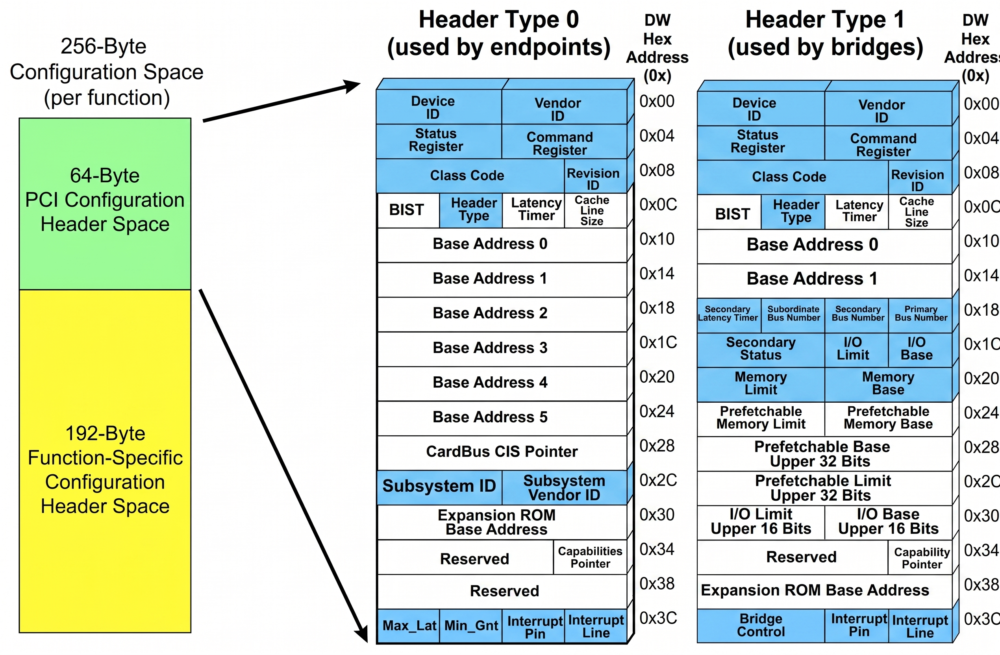

# PCIe
## 1. PCIe 拓扑与 BDF 物理寻址机制
PCIe 使用 **BDF (Bus, Device, Function)** 来唯一标识系统中的每一个 PCIe 设备功能单元：
- **Bus (总线号)**：8 位（0 ~ 255）
- **Device (设备号)**：5 位（0 ~ 31）
- **Function (功能号)**：3 位（0 ~ 7）

`00:15.0 -> 00000000:10101.000` 

组件
- Root Complex 
- PCIe Switch 
- PCIe Endpoint 
- PCIe Bridge 

## 2. PCIe 四大地址空间
PCIe 体系定义了四种独立的地址空间：
1. **Memory 空间**：用于映射外设寄存器（MMIO）以及发起或响应与主存 DMA 的数据传输
2. **Configuration 空间**：用于系统枚举、资源分配与设备初始化（每个 Function 拥有 4KB）
3. **I/O 空间**：兼容传统 x86 端口 I/O
4. **Message 空间**：带内带外消息传递（如电源管理、错误报告 AER）


### 2.1 PCIe 配置空间架构
```
每个PCIe function 有4KB配置空间
┌─────────────────────────────────┐ 
│ 0x000 - 0x03F (共 64 字节)       │ ◄─── （Type 0 / 1 Header）
│ 标准 PCI 配置头 (Compatible)     │      存放 Device ID、Vendor ID、BAR0 等基础寄存器
├─────────────────────────────────┤ 
│ 0x040 - 0x0FF (共 192 字节)      │ ◄─── 传统 PCI 能力结构体区 (Capabilities)
│ PCI 传统能力链表区              │      用链表连着：MSI 中断、电源管理 (PM) 
│ (包含 CAP_EXP 链路调速寄存器)     │      以及【PCI Express 能力结构体】
▼═════════════════════════════════▼ ◄─── [256 字节分界线] 传统老 PCI 只能访问到这里
▲═════════════════════════════════▲
│ 0x100 - 0xFFF (共 3840 字节)     │ ◄─── PCIe 扩展配置空间 (Extended Configuration Space)
│ PCIe 扩展能力结构体区           │      也是用链表连接，全都是现代 PCIe 特有的高级功能
│ (包含 AER 高级错误报告寄存器)    │      例如：AER 错误报告、SR-IOV、虚拟通道 (VC) 等
└─────────────────────────────────┘
```

> [!NOTE]
> NVMe SSD 属于终端端点设备（Endpoint），其 PCI 配置头格式固定为 **Header Type 0**（非桥接设备 Type 1）。
> Type 1 -> Root port / Switch / Bridge




### 2.2 NVMe 配置空间设备实例

```

$ sudo lspci -s 03:00.0 -xxx 查看前256Bytes (-xxxx就是查看4KB)
 
03:00.0 Non-Volatile memory controller: VMware NVMe SSD Controller
00: ad 15 f0 07 07 04 10 00 00 02 08 01 00 00 00 00
10: 04 c0 4f fd 00 00 00 00 01 40 00 00 00 00 00 00
20: 00 00 00 00 00 00 00 00 00 00 00 00 ad 15 f0 07
30: 00 00 00 00 40 00 00 00 00 00 00 00 0a 01 00 00
40: 01 50 03 c8 00 00 00 00 00 00 00 00 00 00 00 00
50: 05 70 80 00 00 00 00 00 00 00 00 00 00 00 00 00
60: 00 00 00 00 00 00 00 00 00 00 00 00 00 00 00 00
70: 11 80 0f 80 00 20 00 00 00 30 00 00 00 00 00 00
80: 10 00 02 00 00 00 00 00 00 00 00 00 02 06 00 00
90: 00 00 02 02 00 00 00 00 00 00 00 00 00 00 00 00
[...]
```

**基础数据**
- **Vendor ID (0x00 ~ 0x01)**: `15ad` (小端序 `ad 15` $\to$ VMware Inc.)
- **Device ID (0x02 ~ 0x03)**: `07f0` (小端序 `f0 07` $\to$ NVMe Controller)
- **Status / Command (0x04 ~ 0x07)**: `00100407` (使能 Bus Master 与 MMIO 空间)
- **Class Code (0x08 ~ 0x0B)**: `01 08 02 00` $\to$ Mass Storage (01), Non-Volatile Memory (08), NVM Express (02)


**BAR地址**
偏移 `0x10`（BAR0）与 `0x14`（BAR1）的数据为：`04 c0 4f fd` 和 `00 00 00 00`：
- **BAR0 原始值**：`0xfd4fc004`
- **低 4 位标志位（Bit 0 ~ Bit 3）解析**： 0100
  - **Bit 0 (`0`)**：`0` = Memory 空间（MMIO）；`1` = I/O 端口空间
  - **Bit 2:1 (`10`b = 2)**：
    - `00`b = 32 位基地址
    - `10`b = **64 位基地址**（占用 BAR0 + BAR1 组合寻址）
  - **Bit 3 (`0`)**：`0` = 不可预取（Non-prefetchable）必须严格一读一写
     - tip:为 1 可预取Prefetchable，说明没有读副作用，CPU 可以开缓存优化
- **64 位物理基地址**：
  - **Base Address** =  `0x00000000fd4fc000`


**链表能力**
- 偏移 `0x34`是 **Capabilities Pointer**,记录链表首节点的偏移地址
```
 字节地址：    0x40                 0x41
             ┌────────────────────┬────────────────────┐
 寄存器定义： │   Capability ID    │    Next Pointer    │
             └────────────────────┴────────────────────┘
 长度：       1 字节 (8 bits)       1 字节 (8 bits)

34:40
40:01 50   01 -> PCI Power Manage
50:05 70   05 -> MSI
70:11 80   11 -> MSI-X
80:10 00结束  10 -> PCI Express Capability
```

### 2.3 NVMe 配置空间设备实例2

#### 2.3.1 Type 0 Header
```
+-----------+-----------+-----------+-----------+-----+
|  Byte 3   |  Byte 2   |  Byte 1   |  Byte 0   | DWD |
+-----------+-----------+-----------+-----------+=====+
| Device ID: 0071       | Vendor ID: 1E49       | 000 |
+=======================+=======================+=====+
| Status: 0010          | Command: 0406         | 004 |
+===================================+===========+=====+
| Class Code: 010802                | Rev: 01   | 008 |
+-----------+-----------+-----------+-----------+=====+
| BIST: 00  | Type: 00  | Lat: 00   | CLS: 10   | 00C |
+===========+===========+===========+===========+=====+
| BAR0 (Low 32-bit): F4D00004                   | 010 |
+-----------------------------------------------+-----+
| BAR1 (High 32-bit): 00000000                  | 014 |
+-----------------------------------------------+-----+
| BAR2 (Index/Data): 00000000                   | 018 |
+-----------------------------------------------+-----+
| BAR3: 00000000                                | 01C |
+-----------------------------------------------+-----+
| BAR4: 00000000                                | 020 |
+-----------------------------------------------+-----+
| BAR5: 00000000                                | 024 |
+-----------------------------------------------+-----+
| Cardbus CIS Pointer: 00000000                 | 028 |
+-----------------------------------------------+-----+
| Subsystem Vendor ID: 00711E49                 | 02C |
+-----------------------------------------------+-----+
| Expansion ROM Base: 00000000                  | 030 |
+===================================+===========+=====+
| Reserved: 000000                  | Cap: 40   | 034 |
+===================================+===========+=====+
| Reserved: 00000000                            | 038 |
+-----------+-----------+-----------+-----------+=====+
| Max: 00   | Min: 00   | Pin: 01   | Line: 00  | 03C |
+-----------+-----------+-----------+-----------+-----+
```


#### 2.3.2 PCI Power Management
```
+-----------------------+-----------+-----------+-----+
|          PMC          | Next_Ptr  |  Cap_ID   |     |
|         0003          |    50     |    01     | 040 |
+-----------+-----------+-----------+-----------+-----+
|   Data    |                 PMCSR             |     |
|    00     |                000008             | 044 |
+-----------+-----------------------------------+-----+
```
- **Cap_ID** (0x01)
  - PCI 电源管理能力
- **PMC** (0x0003) 
  - 电源管理能力寄存器 Power Management Capabilities
- **PMCSR**(0x000008)
  - 电源管理控制/状态寄存器 Power Management Control/Status Register


#### 2.3.3 MSI
```
+-----------------------+-----------+-----------+-----+
|    Message Control    | Next_Ptr  |  Cap_ID   |     |
|         018A          |    70     |    05     | 050 |
+-----------------------+-----------+-----------+-----+
```
- **Cap_ID** (0x05)
  - MSI 中断能力
- **Message Control**
  - MSI 消息控制寄存器 Message Control Register


#### 2.3.4 PCI Express 
```
+-----------------------+-----------+-----------+-----+
| PCIe Cap: 3E02        | Next: B0  |  Cap: 10  | 070 |
+-----------------------+-----------+-----------+-----+
| Device Capabilities: 112C8FC2                 | 074 |
+-----------------------+-----------------------+-----+
| Dev Status: 0019      | Dev Control: 2057     | 078 |
+-----------------------+-----------------------+-----+
| Link Capabilities: 00476844                   | 07C |
+-----------------------+-----------------------+-----+
| Link Status: 1044     | Link Control: 0040    | 080 |
+-----------------------+-----------------------+-----+
| Slot Capabilities: 00000000                   | 084 |
+-----------------------+-----------------------+-----+
| Slot Status: 0000     | Slot Control: 0000    | 088 |
+-----------------------+-----------------------+-----+
| Root Cap: 0000        | Root Control: 0000    | 08C |
+-----------------------+-----------------------+-----+
| Root Status: 00000000                         | 090 |
+-----------------------+-----------------------+-----+
| Device Capabilities 2: 0005081F               | 094 |
+-----------------------+-----------------------+-----+
| Dev Status 2: 0000    | Dev Control 2: 0400   | 098 |
+-----------------------+-----------------------+-----+
| Link Capabilities 2: 0180001E                 | 09C |
+-----------------------+-----------------------+-----+
| Link Status 2: 011F   | Link Control 2: 0004  | 0A0 |
+-----------------------+-----------------------+-----+
```
- **Cap_ID** (0x10)
  - PCI Express 能力结构标识


#### 2.3.5 MSI-X
```

+-----------------------+-----------+-----------+-----+
|    Message Control    | Next_Ptr  |  Cap_ID   |     |
|         8010          |    00     |    11     | 0B0 |
+-----------------------+-----------+---+-------+-----+
|              Table Offset             |  BIR  |     |
|                00003000               |  000b | 0B4 |
+---------------------------------------+-------+-----+
|               PBA Offset              |  BIR  |     |
|                00002000               |  000b | 0B8 |
+---------------------------------------+-------+-----+
```
- **Cap_ID** (0x11)
  - MSI-X
- **Message Control** (0x8010)
  - **Table Size** Bits[10：0] ： 0000010000b 表示16+1 个中断向量
  - **MSI-X Enable** Bits[15] : 1b  表示MSI-X 使能
- **BIR** 
  - 000b 表示BAR0 001b表示BAR1 ....  101b表示BAR5 剩余两个保留
- **Table Offset** (0x00003000)
  - 中断向量表 BIR + 0x3000
- **PBA Offset** (0x00002000 )
  - 中断挂起状态表 BIR + 0x2000
#### 2.3.6 AER
```
+-----------------------------------------------+-----+
| AER Ext Cap Header: 14820001                  | 100 |
+-----------------------------------------------+-----+
| Uncorrectable Error Status: 00000000          | 104 |
+-----------------------------------------------+-----+
| Uncorrectable Error Mask: 00400000            | 108 |
+-----------------------------------------------+-----+
| Uncorrectable Error Severity: 00462030        | 10C |
+-----------------------------------------------+-----+
| Correctable Error Status: 00002000            | 110 |
+-----------------------------------------------+-----+
| Correctable Error Mask: 0000E000              | 114 |
+-----------------------------------------------+-----+
| Adv Error Cap & Control: 000000A0             | 118 |
+-----------------------------------------------+-----+
| Header Log (1st DW): 00000000                 | 11C |
+-----------------------------------------------+-----+
| Header Log (2nd DW): 00000000                 | 120 |
+-----------------------------------------------+-----+
| Header Log (3rd DW): 00000000                 | 124 |
+-----------------------------------------------+-----+
| Header Log (4th DW): 00000000                 | 128 |
+-----------------------------------------------+-----+
```
- **Header** (0x14820001)
  - **Cap_ID**： (0x0001) AER 能力标识符
  - **Version**：(0x2) AER 规范版本 2
  - **Next_Item_Ptr**：(0x148) 指向下一个扩展能力结构的偏移（位于 0x148）
- **Adv Error Cap & Control** (0x000000A0)
  - **First Error Pointer** Bits [4:0] ： 0000b
  - **ECRC Generation Capable** Bits[5] ：1b   硬件支持ECRC生成
  - **ECRC Generation Enable** Bits[6] ： 0b   ECRC 生成当前处于禁用状态
  - **ECRC Check Capable** Bit [7] = 1 ：1b   硬件支持 ECRC 校验
  - **ECRC Check Enable** Bit [8] = 0 ：0b   ECRC 校验当前处于禁用状态
  - **Multiple Header Recording Capable** Bit[9] = 0
  - **Multiple Header Recording Enable**  Bit[10] = 0


`[...]`


## 3. TLP 事务类型与响应机制

PCIe TLP报文分为 **Posted（非阻塞，无需响应）** 与 **Non-Posted（阻塞，需回传 Completion 报文）**：


| 事务空间  | 事务类型  | 发送属性 | 对应的响应包  | 典型应用场景 |
| :--- | :--- | :--- | :--- | :--- |
| **Memory** | 内存读 (`MRd`) | **Non-Posted** | `CplD` (Complete with Data) | 1.主机读取 MMIO 寄存器  <br> 2.SSD DMA 读取 Host 内存  |
| | 内存写 (`MWr`) | **Posted** | **无**（链路层回 Ack DLLP） | 1.主机写入 MMIO 寄存器 <br> 2.SSD DMA 写入 Host 内存<br> 3.MSI-X 中断触发 |
| | 带锁内存读 (`MRdLk`) | **Non-Posted** | `CplLkD` / `CplLk` | 原子操作与兼容锁 |
| **Configuration** | 配置读 0 / 1 (`CfgRd0`/`CfgRd1`) | **Non-Posted** | `CplD` | 系统枚举读取设备 ID / BAR 属性 |
| | 配置写 0 / 1 (`CfgWr0`/`CfgWr1`) | **Non-Posted** | `Cpl` (无数据的状态确认) | 配置 BAR 地址 / 使能 Bus Master |
| **I/O** | I/O 读 (`IORd`) | **Non-Posted** | `CplD` | 传统 I/O 端口访问 |
| | I/O 写 (`IOWr`) | **Non-Posted** | `Cpl` | 传统 I/O 端口写入 |
| **Message** | 消息请求 (`Msg` / `MsgD`) | **Posted** | **无** | 链路错误通知、PME 电源事件 |

## 3.1 TLP类型结构

### 3.1.1 TLP封装 PCIe3-5 (Non-Flit Mode)
```
+---------------+-------------------+--------------------+
| Header (3/4DW)| Payload (0-1024DW)| Digest/ECRC (1DW)* | 
+---------------+-------------------+--------------------+

<--------------------------- TLP ------------------------>
```
- 尾部是否有ECRC 看**配置空间AER寄存器相关bit位是否配置** 还要看**TLP header TD(bit15)位是否使能**没配置则不加上**ECRC**
- 一般情况ECRC 都是没有的


### 3.1.2 内存TLP header格式
```
4DW 内存读header头
31  29 28   24 23 22 20 19 18 17 16 15 14 13 12 11 10 9        0
+-----+-------+--+-----+--+--+--+--+--+--+-----+-----+-----------+
| Fmt | Type  |R | TC  |R |A2|R |TH|TD|EP|Attr | AT  |  Length   | DW0
| 001 | 00000 |0 | 000 |0 |0 |0 |0 |0 |0 | 00  | 00  | (DW 计数) |
+-----+-------+--+-----+--+--+--+--+--+--+-----+-----+-----------+
|        Requester ID (16b)        |    Tag (8b)   |Last | First | DW1
|          (Bus:Dev:Func)          |   (00000000)  | BE  |  BE   |
+----------------------------------+---------------+-----+-------+
|                    Address [63:32] (高 32 位)                  | DW2
|                             (32-bit)                          |
+---------------------------------------------------------+-----+
|                    Address [31:2]  (低 30 位)           | 00  | DW3
|                             (30-bit)                    | (2b)|
+---------------------------------------------------------+-----+
```
- 目标地址为32位地址也就是4GB内，就没有DW2，DW3代替DW2位置
- Fmt 000b 3DW 读  | 001b 4DW 读 | 010b 3DW 写 | 011b 4DW 写
- Type 00000b 标准内存事务报文


### 3.1.3 配置Type0 TLP header格式
```
31  29 28   24 23 22 20 19 18 17 16 15 14 13 12 11 10 9        0
+-----+-------+--+-----+--+--+--+--+--+--+-----+-----+-----------+
| Fmt | Type  |R | TC  |R |A2|R |TH|TD|EP|Attr | AT  |  Length   | DW0
| 000 | 00100 |0 | 000 |0 |0 |0 |0 |0 |0 | 00  | 00  |0000000001 | 
+-----+-------+--+-----+--+--+--+--+--+--+-----+-----+-----------+
|        Requester ID (16b)        |    Tag (8b)   |Last | First | DW1
|          (Bus:Dev:Func)          |   (00000000)  |0000 |  BE   |
+-----------------------+----------+---+-------+---+-----+-------+
|    Bus Number (8b)    |Device(5b)|Func(3b)|Ext(4b)| Reg(6b) |00 | DW2
|     [31:24]           |          |        |       |         |(2)|
+-----------------------+----------+--------+-------+---------+---+
```
- Fmt 000b 配置读 | 010b 配置写  
- Type 00100b  Type0 配置读写


### 3.1.4 消息TLP header格式
NVMe AER错误报告 电源管理 延迟容忍报告等等消息
```
31  29 28   24 23 22 20 19 18 17 16 15 14 13 12 11 10 9        0
+-----+-------+--+-----+--+--+--+--+--+--+-----+-----+-----------+
| Fmt | Type  |R | TC  |R |A2|R |TH|TD|EP|Attr | AT  |  Length   | DW0
| 001 | 10rrr |0 | 000 |0 |0 |0 |0 |0 |0 | 00  | 00  | (DW 计数) |
+-----+-------+--+-----+--+--+--+--+--+--+-----+-----+-----------+
|        Requester ID (16b)        |    Tag (8b)   | Message Code| DW1
|          (Bus:Dev:Func)          |   (00000000)  |    (8b)     |
+----------------------------------+---------------+-------------+
|                     Message[63:32] (32-bit)                    | DW2
+----------------------------------------------------------------+
|                     Message[31:0]  (32-bit)                    | DW3
+----------------------------------------------------------------+
```
- Fmt 001b 带数据 | 011b 不带数据 末尾都是1表示4DW
- Type 10rrrb  rrr是路由子字段


### 3.1.5 响应TLP header格式
```
31  29 28   24 23 22 20 19 18 17 16 15 14 13 12 11 10 9        0
+-----+-------+--+-----+--+--+--+--+--+--+-----+-----+-----------+
| Fmt | Type  |R | TC  |R |A2|R |TH|TD|EP|Attr | AT  |  Length   | DW0
|000/1| 01010 |0 | TC  |0 |A2|0 | 0|TD|EP|Attr | 00  | (DW 计数) |
+-----+-------+--+-----+--+--+--+--+--+--+-----+-----+-----------+
|         Completer ID         |CplSt|B |      Byte Count        | DW1
|        (Bus:Dev:Func)        |(3-b)|0 |       (12-bit)         |
+------------------------------+-----+--+-----------------------+
|         Requester ID         |      Tag      |R| Lower Address | DW2
|        (Bus:Dev:Func)        |    (8-bit)    |0|    (7-bit)    |
+------------------------------+---------------+-----------------+
```
- Fmt 010b 带数据 | 000b 不带数据
- Type 01010b 标准完成包


## 3.2 NVMe I/O 在 PCIe 链路上的阶段

单个TLB 有效数据上限4KB，主要看 在**PCI express**中**Device Control**寄存器
- Max_Payload_Size  单个TLP有效数据 MPS 128B <---> 4096B 2的倍数 (不能跨页)
- Max_Read_Request_Size 单个读请求TLP可以读数据 MRRS 128B <---> 4096B 2的倍数 (不能跨页)


**Ack DLLP 是累计确认不一定是一个TLP包就会返回一个Ack DLLP,图示只是展示协议闭环逻辑**

```
执行write(sq_tail) 
阶段一：Host 更新 SQ Tail Doorbell (MMIO Write - Posted 事务)      
PCIe 链路 (Host / Root Complex)                        PCIe 链路 (SSD)                  
    │─────── MWr TLP (数据: sq_tail) ─────────────────────>│ (物理接收)        
    │<────── Ack DLLP (确认 MWr 报文接收无误) ─────────────│ (电路自动回复) 

阶段二：SSD 主动 DMA 拉取 64B 命令 (Command Fetch - Non-Posted 事务)
    │<───── MRd TLP (请求 64 字节 SQE + SQ 物理地址) ───────│ (SSD 发起 DMA 读) 
    │───────── Ack DLLP (确认 MRd 报文接收无误) ───────────>│                   
 (从 Host DRAM 读出 64B 命令)                                                                  
    │──── CplD TLP (带 64B 命令数据: Opcode/CID/PRP) ─────>│ (完成报文下灌)    
    │<────── Ack DLLP (确认 CplD 报文接收无误) ─────────────│                   
 
阶段三：数据双向 DMA 搬运
(写操作 NVMe Write)
    │<─────────────── MRd TLP (请求数据) ──────────────────│ (SSD 沿 PRP 抓数据)
    │──────── Ack DLLP (确认 MRd 报文接收无误) ───────────>│                   
 (从 Host DRAM 读取用户数据)                                                                   
    │────────────── CplD TLP (数据) ──────────────────────>│ 
    │<──────── Ack DLLP (确认 CplD 报文接收无误) ───────────│                   
                                                                                           
(读操作 NVMe Read)
    │<─────────────── MWr TLP (数据 ) ─────────────────────│
    │────── Ack DLLP (确认 MWr 报文接收无误) ──────────────>│


阶段四：写回 16B CQE 结果 与 发送 MSI-X 硬件中断
    │             ─── 步骤 1：SSD DMA 写回 CQE ───          │
    │<──── MWr TLP (16B CQE 数据: Status/CID/Phase Tag) ───│ (写入 Host CQ 槽位)
    │─────── Ack DLLP (确认 MWr 报文接收无误) ─────────────>│
 (16B 写入 Host DRAM CQ)                                     
    │                                                      │
    │             ─── 步骤 2：SSD 发射 MSI-X 中断 ───       │
    │<───── MWr TLP (目标: 0xFEE00000 APIC, 载荷: 向量58) ──│ (发射中断报文)
    │─────── Ack DLLP (确认 MWr 报文接收无误) ──────────────>│

阶段五：Host 更新 CQ Head Doorbell (MMIO Write - Posted 事务)
Host / Root Complex                                       SSD
    │─────── MWr TLP (更新 cq_head) ─────────────────────>│ (通知 SSD 槽位已释放)
    │<────── Ack DLLP ────────────────────────────────────│
```


## 4.DLLP 事务类型
## 4.1 DLLP
### 4.1.1 DLLP状态机
```
    Reset
      │
      ▼
┌─────────────┐
│ DL_Inactive │◄──────┬──────┬──────┐
└─────────────┘       │      │      │
   │       │          │      │      │
   │       ▼          │      │      │
   │ ┌─────────────┐  │      │      │
   │ │ DL_Feature  │──┘      │      │
   │ └─────────────┘         │      │
   │       │                 │      │
   │       ▼                 │      │
   │ ┌─────────────┐         │      │
   └►│   DL_Init   │─────────┘      │
     └─────────────┘                │
           │                        │
           ▼                        │
     ┌─────────────┐                │
     │  DL_Active  │────────────────┘
     └─────────────┘
```


### 4.1.2 DLLP 报文类型
| 报文大类 | 报文类型  | 触发时机 | 核心作用 |
| :--- | :--- | :---  | :--- |
| **重传与确认** | `Ack`  | 接收 TLP 校验通过且序号等于 `NEXT_RCV_SEQ` | 累积确认：释放 Retry Buffer 中序列号 $\le$ 该序号的全部在途缓存 |
| | `Nak`  | 接收端检出 LCRC 错或发现序号跳跃不连续 | 携带最后正确接收的序号 $X$，强制发送端从 $X+1$ 开始重传 后续 TLP |
| **流控初始化** | `InitFC1-P`<br>`InitFC1-NP`<br>`InitFC1-Cpl`  | 物理链路就绪进入 `DL_Init` 之初连续轮询广播 | 广播本端接收缓冲区中 Posted(写)、Non-Posted(读)、Completion(读返回) 的初始可用信用额度 |
| **流控确认** | `InitFC2-P`<br>`InitFC2-NP`<br>`InitFC2-Cpl`  | 收全对端的三种 `InitFC1` 报文后进入 `FC_INIT2` 阶段 | 确认对端流控参数；当双方均收全三种 `InitFC2` 后，数据链路层正式进入 `DL_Active` 激活态 |
| **流控动态更新** | `UpdateFC-P`<br>`UpdateFC-NP`<br>`UpdateFC-Cpl`  | `DL_Active` 状态下缓冲区被上层消费释放，或定时防死锁机制触发 | 归还信用额度：分别归还 P、NP、Cpl 的信用点数 |
| **电源管理** | `PM_Enter_L1`  | 软件发起 (OS/驱动写配置空间切入 D1/D2/D3hot) | 准备进入 L1 浅度电源休眠 |
| | `PM_Enter_L23`  | 系统关机断电 (S3/S4/S5) 或移除设备 | 准备切断主电源，请求进入 L2/L3 深度休眠 |
| | `PM_Active_State_Request_L1`  | ASPM 硬件链路空闲超时 | 设备主动申请切入 ASPM L1 节能态 |
| | `PM_Request_Ack`  | 收到 L1 申请或休眠指令后完成准备就绪 | 确认同意休眠请求，双方物理层进入电气空闲 |


## 4.2 DLLP 类型结构
### 4.2.1 DLLP封装 PCIe3-5 (Non-Flit Mode)
```
+-------------------+------------------------+--------------------+
|   Type (1 Byte)   |    Payload (3 Bytes)   |   CRC-16 (2 Bytes) |
+-------------------+------------------------+--------------------+

<----------------------------- DLLP ------------------------------>
```


```
+----------------------+-----------------------+------------------+
| Sequence Number (2B) |  TLP from Upper Layer | LCRC-32(4 Bytes) |
+----------------------+-----------------------+------------------+

<----------------- Data Link Layer Transferred TLP --------------->
```

### 4.2.2 Ack / Nak 格式
```
31             24 23         16 15 14 13 12 11                 0
+---------------+-------------+---+--+--+--+-------------------+
|      Type     |  Reserved   | R | R| R| R|  AckNak_Seq_Num   | DW0
| 00000000      |   (8-bit)   | 0 | 0| 0| 0|     (12-bit)      |
+---------------+-------------+---+--+--+--+-------------------+
|        16-bit CRC           |                                
|        (CRC-16)             |                                
+-----------------------------+
```
- Type 00000000b 表示Ack | 00010000b 表示 Nak


## 5.PLP类型

## 5.1 PLP

### 5.1.1 PLP 封装PCIe3-5 (Non-Flit Mode)
```
+----------------+-------------+-----------------------+--------------+
| STP Token (4B) | Seq Num (2B)|  TLP from Upper Layer | LCRC-32 (4 B)|
+----------------+-------------+-----------------------+--------------+

<------------------ Physical Layer Transmitted TLP ------------------->
```


```
+----------------+----------------------------------------------------+
| SDP Token (2B) |               DLLP from Data Link Layer            |
|                |          (Type 1B + Payload 3B + CRC-16 2B)        |
+----------------+----------------------------------------------------+

<------------------ Physical Layer Transmitted DLLP ------------------>
```
- 8 Bytes

### 5.2 
Ordered Sets(有序集)
链路训练序列（TS1 / TS2 Ordered Sets）
- TS1 
- TS2 

快速训练序列（Fast Training Sequence）
- FTS

时钟补偿序列（Skip Ordered Set）
- SKP


符号对齐序列（Start of Data Stream）
- SDS

电气闲置退出序列（Exit Electrical Idle Ordered Set）
- EIEOS


### 5.3 128 /130
数据块header  10b  16字节payload进行异或
有序集块header 01b 16字节payload不需要异或

## 6.LTSSM
11种状态
- Detect

- Polling

- Configuration

- L0

- Recovery

- L0s

- L1

- L2

- Hot Reset

- Disable

- Loopback


