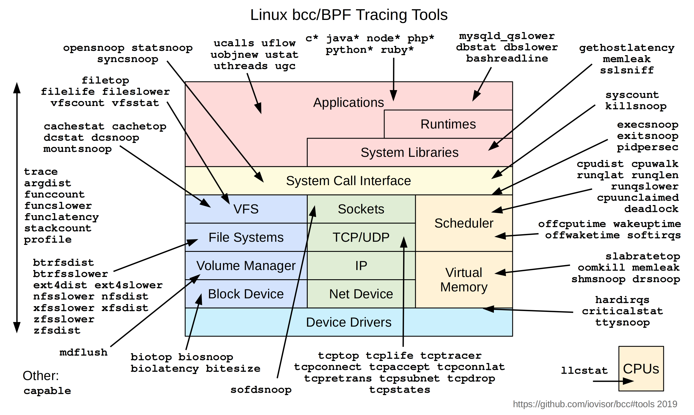

## sar


## iostat
`iostat`

```
# -x 扩展统计信息  -m 以MB/s单位显示 -t 显示时间戳 -d 查看特定磁盘 1 间隔 1s  5 总刷新5次
$ iostat -xmt -d nvme0n1 1 5
# 这里第一行数据是开机以来的历史平均值，不是实时数据，不参考
# 第二行以后才是每秒的实时数据

示例
Device            r/s     rkB/s   rrqm/s  %rrqm r_await rareq-sz     w/s     wkB/s   wrqm/s  %wrqm w_await wareq-sz     d/s     dkB/s   drqm/s  %drqm d_await dareq-sz     f/s f_await  aqu-sz  %util
nvme0n1          0.01      0.12     0.00   0.00    0.17    21.21    0.00      0.00     0.00   0.00    0.00     0.00    0.00      0.00     0.00   0.00    0.00     0.00    0.00    0.00    0.00   0.00
nvme0n1          0.00      0.00     0.00   0.00    0.00     0.00    0.00      0.00     0.00   0.00    0.00     0.00    0.00      0.00     0.00   0.00    0.00     0.00    0.00    0.00    0.00   0.00

r/s w/s 每秒 I/O 次数 / IOPS
rkB/s wkB/s 吞吐量 / Bandwidth
r_await / w_await 读/写平均响应时间
aqu-sz Average Queue Size 平均队列长度
```


## strace 
打印出进程所执行的系统调用及其信号


## perf


## blktrace 
`blktrace`

```
# -d 查看特定磁盘 -o 指定输出文件名 -w 设置运行时间 -a 事件过滤器 -b 内核事件缓冲大小(默认512KB) -n 缓冲区数量(默认4个)
$ sudo blktrace -d /dev/nvme0n1 -o trace -w 30

示例
=== nvme0n1 ===
  CPU  0:               635515 events,    29790 KiB data
  CPU  1:              1001939 events,    46966 KiB data
  CPU  2:               753474 events,    35320 KiB data
  CPU  3:               425971 events,    19968 KiB data
  Total:               2816899 events (dropped 0),   132043 KiB data


# -i 源文件路径  -o 输出文本报告 -d 导出合并的二进制文件(供btt解析)
$ blkparse -i trace -o trace.txt

$ blkparse -i trace -d trace.bin

# trace.txt文件
字段含义 [主次设备号 CPU核心编号 序列号 时间戳 进程ID 事件类型/动作代码 操作类别/标志 起始扇区号+扇区数量 进程名]
示例
259,0    0      177     0.000991321 10587  P   N [fio]
259,0    0      178     0.000991511 10587  U   N [fio] 1
259,0    0      179     0.000994111 10587  D  WS 4403200 + 256 [fio]
259,0    0      180     0.001016281 10587  Q  WS 4403456 + 256 [fio]
259,0    0      181     0.001017531 10587  G  WS 4403456 + 256 [fio]
259,0    0      182     0.001017811 10587  P   N [fio]
259,0    0      183     0.001018001 10587  U   N [fio] 1
259,0    0      184     0.001020601 10587  D  WS 4403456 + 256 [fio]
259,0    0      185     0.001852373     0  C  WS 4395520 + 256 [0]
259,0    0      186     0.001897952     0  C  WS 4395776 + 256 [0]


- Q (Queued): IO 请求进入到块设备层
- G (Get Request): 内核成功为 IO 请求分配了 request 结构体
- P (Plug): 开启本地蓄水池
- I (Inserted): 请求进入IO调度器队列
- U (Unplug): 蓄水池放水
- D (Driver): 请求正式下发给底层驱动,准备提交给硬件控制器
- C (Complete): 硬件完成该 IO 请求,向 CPU 发送中断,内核回收请求


# -i 解析文件名 -o 输出文件名
$ btt -i trace.bin -o report


- Q2Q 相邻IO发出间隔时间(可以计算大致的IOPS)
- Q2C 从请求诞生到硬件写完时间 
- D2C 从下发驱动到硬件写完时间
```

## debugfs
接口/sys/kernel/debug
部分调试功能由于内核编译时未开启导致未在子目录出现


## Ftrace / tracefs
ftrace本质是tracefs 追踪虚拟文件系统
接口/sys/kernel/tracing


**trace-cmd** (ftrace的前端工具)
日志设置其他盘符/dev/shm

```
$ trace-cmd record 
-p <tracer>: 指定追踪器 相当于 current_tracer
-e <event>: 指定事件 相当于 set_event 
-l <function>: 指定函数 相当于 set_ftrace_fliter 
-g <function>: 指定函数 相当于 set_graph_function 
-o <file>: 指定输出文件名(默认trace.dat)
-b <size>: 设置Ring buffer大小
-F <executable_path>: 追踪指定可执行程序
-P <pid>: 追踪指定pid进程
sleep n: 持续n秒


$ sudo trace-cmd record -p function_graph -g "blk_mq_submit_bio" dd if=/dev/zero of=/dev/nvme0n1 bs=4M count=1 oflag=direct

  plugin 'function_graph'
1+0 records in
1+0 records out
4194304 bytes (4.2 MB, 4.0 MiB) copied, 0.0277285 s, 151 MB/s
CPU0 data recorded at offset=0x232000
    4434 bytes in size (20480 uncompressed)
CPU1 data recorded at offset=0x234000
    8007 bytes in size (36864 uncompressed)
CPU2 data recorded at offset=0x236000
    18506 bytes in size (98304 uncompressed)
CPU3 data recorded at offset=0x23b000
    70250 bytes in size (495616 uncompressed)


$ trace-cmd list


$ trace-cmd report
-i <file>: 指定输入的二进制文件
-cpu==<num>: 指定CPU信息

示例
$ sudo trace-cmd report --cpu=3 | grep nvme
              dd-21614 [003] 96692.936607: funcgraph_entry:                   |          nvme_queue_rqs() {
              dd-21614 [003] 96692.936608: funcgraph_entry:                   |            nvme_prep_rq() {
              dd-21614 [003] 96692.936608: funcgraph_entry:        0.850 us   |              nvme_setup_cmd();
              dd-21614 [003] 96692.936613: funcgraph_entry:                   |              nvme_pci_setup_data_prp() {


$ sudo trace-cmd report --cpu=1 
cpus=128
 pool-tracker-mi-3720  [001] 96692.953739: funcgraph_entry:                   |  blk_mq_submit_bio() {
 pool-tracker-mi-3720  [001] 96692.953739: funcgraph_entry:        0.290 us   |    __rcu_read_lock();
 pool-tracker-mi-3720  [001] 96692.953740: funcgraph_entry:        0.350 us   |    __rcu_read_unlock();
 pool-tracker-mi-3720  [001] 96692.953741: funcgraph_entry:                   |    bio_split_rw() {
 pool-tracker-mi-3720  [001] 96692.953741: funcgraph_entry:                   |      bio_split_io_at() {
 pool-tracker-mi-3720  [001] 96692.953741: funcgraph_entry:        0.240 us   |        bvec_split_segs();
 pool-tracker-mi-3720  [001] 96692.953741: funcgraph_entry:        0.190 us   |        bvec_split_segs();
 pool-tracker-mi-3720  [001] 96692.953742: funcgraph_entry:        0.180 us   |        bvec_split_segs();
 pool-tracker-mi-3720  [001] 96692.953742: funcgraph_entry:        0.180 us   |        bvec_split_segs();
 pool-tracker-mi-3720  [001] 96692.953743: funcgraph_entry:        0.190 us   |        bvec_split_segs();
 pool-tracker-mi-3720  [001] 96692.953743: funcgraph_entry:        0.180 us   |        bvec_split_segs();
 pool-tracker-mi-3720  [001] 96692.953744: funcgraph_entry:        0.180 us   |        bvec_split_segs();
 pool-tracker-mi-3720  [001] 96692.953744: funcgraph_entry:        0.200 us   |        bvec_split_segs();
 pool-tracker-mi-3720  [001] 96692.953745: funcgraph_exit:         3.970 us   |      }
 pool-tracker-mi-3720  [001] 96692.953745: funcgraph_entry:                   |      bio_submit_split() {
 pool-tracker-mi-3720  [001] 96692.953745: funcgraph_entry:                   |        bio_submit_split_bioset() {
 pool-tracker-mi-3720  [001] 96692.953745: funcgraph_entry:                   |          bio_split() {
 pool-tracker-mi-3720  [001] 96692.953746: funcgraph_entry:                   |            bio_alloc_bioset() {
 pool-tracker-mi-3720  [001] 96692.953746: funcgraph_entry:                   |              mempool_alloc_noprof() {
 pool-tracker-mi-3720  [001] 96692.953746: funcgraph_entry:        0.180 us   |                __cond_resched();
 pool-tracker-mi-3720  [001] 96692.953747: funcgraph_entry:                   |                mempool_alloc_slab() {
 pool-tracker-mi-3720  [001] 96692.953747: funcgraph_entry:        0.350 us   |                  kmem_cache_alloc_noprof();
 pool-tracker-mi-3720  [001] 96692.953748: funcgraph_exit:         0.970 us   |                }
 pool-tracker-mi-3720  [001] 96692.953748: funcgraph_exit:         1.830 us   |              }


部分函数没看到可能由于static inline修饰

$ trace-cmd clear


```


```KernelShark```：基于 GUI 图形界面的前端分析工具


## perf-tools（Brendan Gregg 的 shell 脚本集）
如 functrace、funccount 等轻量级脚本，底层依赖 ftrace 完成快速函数观测


## eBPF前端工具

| 探针类型 | 全称 | 作用对象 | 探测位置 | 特点与局限 |
| :--- | :--- | :--- | :--- | :--- |
| **kprobe** | Kernel Probe | 内核空间 | 任意内核函数起始处 | 动态追踪，内核更新可能导致函数名失效 |
| **kretprobe** | Kernel Return Probe | 内核空间 | 内核函数返回处 | 用于获取函数返回值 and 执行耗时 |
| **uprobe** | User Probe | 用户空间 | 用户态程序/库的函数起始 | 动态追踪，解析用户态符号表，有一定开销 |
| **uretprobe** | User Return Probe | 用户空间 | 用户态函数返回处 | 用于获取用户态函数返回值 and 执行耗时 |
| **USDT** | User Statically Defined Tracing | 用户空间 | 开发者预定义的特定位置 | 静态埋点，稳定、高性能、参数易读 |
| **tracepoint** | Kernel Tracepoint | 内核空间 | 内核中预定义的特定位置 | 静态埋点，非常稳定、高性能 |

### bpftrace [bpftrace](https://github.com/bpftrace/bpftrace)


### BCC工具集  [BPF Compiler Collection](https://github.com/iovisor/bcc#tools)



libbpf-tools 是 BCC工具集 的现代官方替代品，将传统的 Python 脚本全部用 C 语言原生重写，并深度结合了现代内核的 CO-RE 技术。该工具集能够在几毫秒内启动，运行时无需在目标服务器上安装任何编译器（LLVM/Clang）或内核头文件，仅需几兆字节内存，即可对 Linux 系统的磁盘 I/O、网络、CPU 调度及内存进行极其精准、低开销的内核级实时性能观测 


```
BCC
### biolatency：磁盘 I/O 延迟直方图
以直方图形式展示块设备层处理 bio 的延迟分布

$ sudo biolatency-bpfcc 10 1

### biosnoop：实时追踪每一个 I/O 请求的细节
[完成时间戳、进程名、PID、设备名、IO操作类型、扇区、数据块大小、IO响应延迟]


$ sudo biosnoop-bpfcc


### biotop


### bitesize


### biolatpcts

### trace


```


```
libbpf-tools
### biostacks


```


